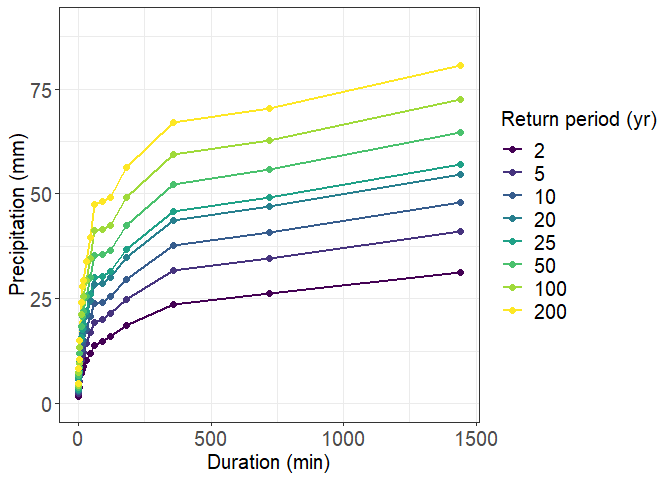
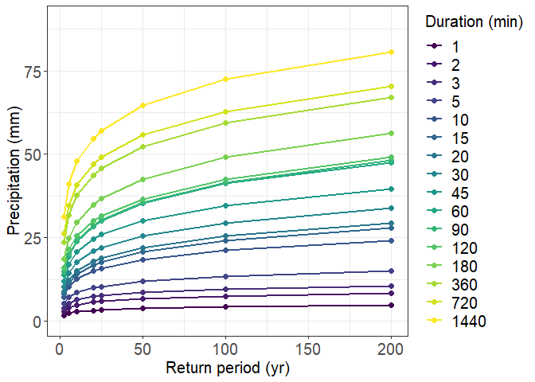
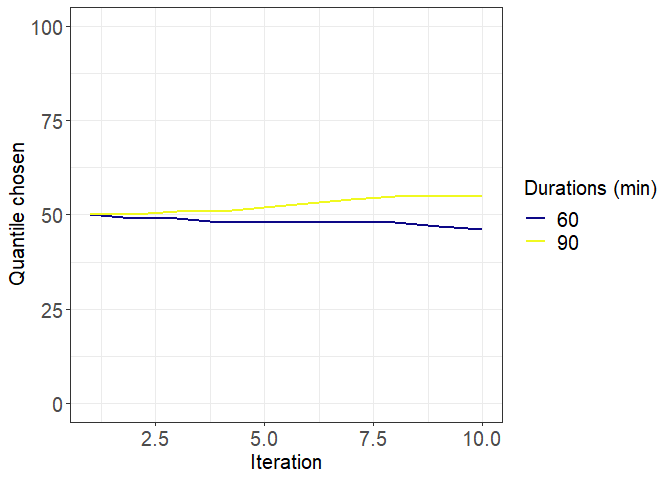

The fixIDF package
================
Thea Roksvåg
<roksvag@nr.no>
28 1 2021


## Overview

An intensity duration frequency (IDF) curve shows the relationship
between rainfall intensities (return levels), the duration of the
intensity and how often the intensity is expected to occur over time
(frequency or return period). Often, IDF curves are fitted to annual
maximum precipitation data, one duration at the time, independently of
other durations. However, this can give inconsistent return levels
across return periods and durations. `fixIDF` is a R package that
includes two functions for adjusting IDF-curves such that they become
consistent across return periods and durations: `fixcurves_alg()` and
`fixcurves_iso()`.

The package can be downloaded in R by writing:

```
Sys.setenv(R_REMOTES_NO_ERRORS_FROM_WARNINGS=TRUE)
library(devtools)
install_github("ClimDesign/fixIDF",ref="main")
```

### fixcurves\_alg()

The function `fixcurves_alg()` is suitable for adjusting return levels
that are obtained from any Bayesian method. It takes the return levels’
1-99 % posterior quantiles as input together with the associated
durations and return periods. The function contains an algorithm that
searches for a consistent set of curves within the 1-99 % posterior
quantiles and tries to find solutions that are as close as possible to
the posterior medians of the initial Bayesian model.

### fixcurves\_iso()

The function `fixcurves_iso()` is suitable for adjusting return levels
that are estimated by any statistical or process-based method. It takes
return levels as input, together with associated durations and return
periods. The return levels are adjusted by using isotonic regression
through the function `iso_pen()` from the package `isotonic.pen()`.

### Visualize the results with plotIDF and plotGEV

Plot functions for plotting the adjusted IDF-curves are available
through the functions `plotIDF()` and `plotGEV()`.

### Important assumptions

  - The functions `fixcurves_alg()` and `fixcurves_iso()` adjust the
    return levels such that they become monotonically increasing as a
    function of duration and return period. Hence, the input return
    levels must be modeled with a unit such that this assumption makes
    sense. A suitable unit for the input precipitation return levels
    would for example be mm. A unit that would be inappropriate would be
    mm/hour.

  - The adjustred return levels that comes out of `fixcurves_alg()` and
    `fixcurves_iso()` are intended as point predictions of the
    underlying return levels. It is recommended to keep the initial
    uncertainty bounds as your measure of uncertainty.

  - The functions `fixcurves_alg()` and `fixcurves_iso()` can also be
    used to adjust QDF curves. Again, the input return levels must be
    given a unit such that it makes sense that the return levels
    increase as a function of duration and return period.


    
    
## How to use the functions

### Testdata: MCMC sampled GEV-parameters

The package contains a dataset that we use to demonstrate how the
functions in the package works. The dataset can be uploaded in the R
environment by writing :

``` r
library(fixIDF)
data("theta",package="fixIDF")
```

The first elements in the data frame `theta` looks like this:

``` r
head(theta)
```

    ##   stnr duration location     scale        shape
    ## 1    2        1 1.549573 0.5307287  0.104955922
    ## 2    2        1 1.397726 0.4604410  0.001645182
    ## 3    2        1 1.308392 0.4604410  0.045354687
    ## 4    2        1 1.308392 0.4604410 -0.084573372
    ## 5    2        1 1.308392 0.4604410 -0.084573372
    ## 6    2        1 1.308392 0.4604410 -0.084573372

The dataset contains parameter samples sampled from a MCMC method. It is
the three parameters of a generalized extreme value distribution,
`location`,`scale` and `shape`, that are estimated based on annual
maximum precipitation data with unit mm from 5 different Norwegian
precipitation stations. A station ID for the precipitation stations are
stored in column `stnr`. The parameters were estimated based on annual
maximum precipitation data from 16 different durations. The durations
are stored in column `duration` and have unit minutes. For each station
and duration, a MCMC procedure was carried out. Hence, we assume one
underlying GEV-distribution for each duration and station, and this is
estimated locally, independently across durations and stations. 3000 of
the MCMC samples for each duration and station are stored in `theta`. Make sure that the
duration numbers are given as numbers and not e.g. as characters or as levels.

In this context, we define the cdf of the three parameter
GEV-distribution as follows:


for  0">, 
where  corresponds to the `location` parameter, 
0"> corresponds to the the `scale` parameter and  corresponds to
the `shape` parameter in `theta`.

### Data preparation

In the following we assume that you either:

*1)* Have fitted annual maximum (precipitation) data to
GEV-distributions for a location of interest. You should have fitted
data from at least two durations, and one GEV-distribution should be
fitted for each duration. The estimation is done by MCMC, and you have
saved a reasonable number of parameter samples (e.g. 3000 MCMC samples
per duration and location). This is the situation illustrated by the
example dataset `theta`.

*2)* Have estimated return levels for several durations and return
periods by using any statistical or process-based method. Your estimated
return levels are summarized through a single summary statistic \(or\)
through the return levels’ posterior (1,2,3,…,98, 99) % quantiles for
each duration and return period.

In the next two subsection we describe how you can prepare your input
data for use in `fixcurves_alg()` and `fixcurves_iso()` in these two
situations.


#### 1\) Data preparation when having GEV-parameter MCMC samples

If you are using a Bayesian MCMC method to estimate return levels you
might have parameter samples corresponding to each of the three
GEV-parameters; location, scale and shape available. The package
`fixIDF` includes a function for computing the return levels’ posterior
quantiles from your parameter samples. The function is called
`compute_quantiles()` and takes a data frame as input. This data frame
must have the columns `duration`, `location`, `scale` and `shape`,
similarly as the example dataset `theta`. However, the data frame should
only include parameter samples for one single precipitation station,
unlike `theta` that has precipitation data from 5 stations.

The function `compute_quantiles()` can for example be used for computing
the return levels’ posterior quantiles for the precipitation station
with `stnr=2` as follows:

``` r
theta_subset=theta[which(theta$stnr==2),]

quant_bay=compute_quantiles(theta_subset,ret.period=c(2,5,10,20,25,50,100,200))
```

Here, `ret.period` refers to some return periods of your choice, given
in years.

The returned object `quant_bay`is a list containing one element for each
of the durations represented in `theta_subset$duration`. The list is
named according to duration (`quant_bay$"dur=..."`) and each element
contains a matrix with the posterior quantiles. The output has the
following structure:

``` r
names(quant_bay)
```

    ##  [1] "dur=1"    "dur=2"    "dur=3"    "dur=5"    "dur=10"   "dur=15"  
    ##  [7] "dur=20"   "dur=30"   "dur=45"   "dur=60"   "dur=90"   "dur=120" 
    ## [13] "dur=180"  "dur=360"  "dur=720"  "dur=1440"

``` r
print(quant_bay$`dur=20`[1:5,])
```

    ##         T=2      T=5     T=10     T=20     T=25     T=50    T=100    T=200
    ## 1% 6.810006 9.125501 10.87555 12.58176 13.09593 14.74099 16.20632 17.72282
    ## 2% 7.004218 9.440677 11.17269 12.85456 13.41257 15.21110 16.99565 18.69677
    ## 3% 7.116918 9.600780 11.33067 13.13197 13.72593 15.53135 17.24427 19.00366
    ## 4% 7.204718 9.686892 11.48426 13.33233 13.93927 15.73043 17.59240 19.26423
    ## 5% 7.290239 9.829351 11.64274 13.47168 14.06868 15.95753 17.84396 19.62728

``` r
print(quant_bay$`dur=20`[93:99,])
```

    ##          T=2      T=5     T=10     T=20     T=25     T=50    T=100    T=200
    ## 93% 10.45642 15.62177 19.63890 24.27040 25.87678 31.81836 39.42507 48.56824
    ## 94% 10.59339 15.82770 19.99422 24.74413 26.46949 32.57936 40.47082 49.60623
    ## 95% 10.69866 16.08608 20.35562 25.34756 27.10353 33.70380 41.66523 51.18132
    ## 96% 10.88009 16.58802 20.87507 26.03160 27.95444 34.50075 42.48198 52.69998
    ## 97% 11.12719 17.06376 21.68384 26.83416 28.69411 35.54470 43.79997 54.42205
    ## 98% 11.34019 17.73239 22.78147 28.33049 30.50030 37.63332 46.33940 57.72428
    ## 99% 11.73062 18.14170 24.34043 31.26327 33.81118 41.00788 52.17805 64.54574

That is, the matrices in `quant_bay$dur=...` contain the return levels
and have one row for each posterior quantile in (1,…,99)% and one column
for each return period that was used as input. The list that was
returned from `compute_quantiles()` can next be used directly as input
in `fixcurves_alg()` and `fixcurves_iso()`.

In order to use `fixcurves_iso()`, you don’t really need the (1,2,…,99)
% posterior quantiles. In fact, you only need the posterior means or
some other type of estimate for the return levels. If your have
GEV-parameter MCMC samples, posterior medians or means can be obtained
by using the function `compute_estimates()`. This takes the same input
as `compute_quantiles` and can be used as follows:

``` r
theta_subset=theta[which(theta$stnr==2),]

mean_bay=compute_estimates(theta_subset,ret.period=c(2,5,10,20,25,50,100,200),type="mean")
median_bay=compute_estimates(theta_subset,ret.period=c(2,5,10,20,25,50,100,200),type="median")
```

Here, the `type` argument refers to what kind of summary statistics you
want for your return levels, and either `"mean"` or `"median"` can be
chosen.

The returned object is a data frame that looks like this:

``` r
head(median_bay)
```

    ##   ret.periods durations ret.levels
    ## 1           2         1   1.670396
    ## 2           5         1   2.334031
    ## 3          10         1   2.783689
    ## 4          20         1   3.237204
    ## 5          25         1   3.367089
    ## 6          50         1   3.830432

It contains the posterior median return levels for your return periods
of interest, for all the durations represented in
`theta_subset$duration`. The returned data frame can be used directly as
input in the `fixcurves_iso()` function.

#### 2\) Data preparation when not having GEV-parameter MCMC samples

If you want to use `fixcurves_alg()`, but use a different type of
distribution than the three parameter GEV-distribution or don’t have
MCMC samples, you have to compute the (1,2,…,99) % posterior quantile
return levels yourself. Then you need to prepare a list of matrices with
the same format as the example list `quant_bay`, shown above. Here, it is 
important to name the list `quant_bay` as `dur=...`. Further,
should the row names of the matrices in `quant_bay$dur...` be `1%,...,99%`
and the columnn names should be `T=...` according to your return periods.

If you want to use `fixcurves_iso()` without having GEV-parameter MCMC
samples available, you need to make a data frame similar to `median_bay`
yourself. This is a data frame with columns `ret.periods`,`durations`
and `ret.levels` containing return periods, durations and estimated
return levels for your precipitation station of interest. The estimated
return levels can be estimated by using any statistical or process-based
method.

### Post-processing of Bayesian quantiles by using `fixcurves_alg()`

After preparing a `quant_bay` list, `fixcurves_alg()` can be used to adjust IDF-curves 
such that the return levels become monotonically increasing as a function of return
period and durations. The function searches for a consistent set of
return levels within the return levels’ 1-99 % posterior quantiles, and
prefers solutions as close as possible to the posterior median.

The function can be used as follows:

``` r
res_alg=fixcurves_alg(quant_bay,maxit=1000,save.history=TRUE,seed=6)
```

    ## [1] "Upwards algorithm converged in 10 iterations."
    ## [1] "Downwards algorithm converged in 10 iterations."
    ## [1] "Upwards alg. gives the best solution."

The function tests two searching strategies, here referred to as the
`upwards` and `downwards` algorithms. The printed output tells us that
both strategies converged in 10 iterations, but the `upwards` strategy
gives adjusted quantiles closer to the initial posterior median. Hence,
the solution corresponding to the `upwards` strategy is returned. The
adjusted IDF-curves can be found in `res_alg$adjusted.curves` and are
stored in a matrix with the following format:

``` r
print(res_alg$adjusted.curves)
```

    ##                T=2       T=5      T=10      T=20      T=25      T=50     T=100
    ## dur=1     1.670396  2.334031  2.783689  3.237204  3.367089  3.830432  4.295241
    ## dur=2     2.960823  4.130378  4.885006  5.665645  5.907348  6.685284  7.518710
    ## dur=3     3.882001  5.341983  6.360125  7.313307  7.616346  8.613726  9.614338
    ## dur=5     5.187820  7.167726  8.553134  9.924509 10.349716 11.871237 13.413476
    ## dur=10    7.155809 10.297425 12.627112 15.037788 15.844799 18.494766 21.351132
    ## dur=15    8.059865 11.525546 14.071601 16.717657 17.662419 20.719306 24.120059
    ## dur=20    8.743109 12.246657 14.946005 17.838549 18.806681 21.961872 25.479447
    ## dur=30   10.394588 14.435929 17.577505 20.892155 21.969330 25.434996 29.363500
    ## dur=45   11.939713 17.029514 20.752320 24.650594 25.951279 30.077620 34.647281
    ## dur=60   13.787575 19.455944 23.811661 28.482149 30.048001 35.330782 41.348665
    ## dur=90   14.698570 19.949003 24.071783 28.737781 30.290865 35.607691 41.433261
    ## dur=120  15.973885 21.401763 25.517488 29.989359 31.516249 36.560695 42.506742
    ## dur=180  18.518611 24.843403 29.690556 34.883384 36.695934 42.510573 49.059173
    ## dur=360  23.657715 31.636225 37.669164 43.703375 45.762995 52.187001 59.447342
    ## dur=720  26.240995 34.670873 40.795898 47.006112 49.094403 55.771725 62.851764
    ## dur=1440 31.274816 41.120611 47.882427 54.715447 57.084492 64.533064 72.502107
    ##              T=200
    ## dur=1     4.777313
    ## dur=2     8.352751
    ## dur=3    10.633906
    ## dur=5    15.045461
    ## dur=10   24.217044
    ## dur=15   27.861428
    ## dur=20   29.431678
    ## dur=30   33.771998
    ## dur=45   39.650596
    ## dur=60   47.584183
    ## dur=90   48.290376
    ## dur=120  49.032339
    ## dur=180  56.298786
    ## dur=360  67.132385
    ## dur=720  70.257802
    ## dur=1440 80.619427

We see that each row represents a duration and each column represents a
return period.

The curves can next be visualized in two different ways by using the
plot functions `plotIDF` and `plotGEV` as follows:

``` r
plotIDF(res_alg$adjusted.curves,ylim=c(0,90),textsize=15,yname="Precipitation (mm)",xname="Duration (min)",legend.name="Return period (yr)")
```

<!-- -->

``` r
plotGEV(res_alg$adjusted.curves,ylim=c(0,90),textsize=15,yname="Precipitation (mm)",xname="Return period (yr)",legend.name="Duration (min)")
```

<!-- -->

The initial posterior medians, i.e. the unadjusted curves, can be found
in `res_alg$unadjusted.curves`. These can also be plotted as shown above
by using `plotIDF()` and `plotGEV()`.

Further, does the function `fixcurves_alg()` return a matrix that shows
which quantile that was chosen for each duration as a function of
iteration for the selection algorithm. This is stored in
`quantile.history` and can be visualized by using the function
`plotHistory` as follows:

``` r
plotHistory(res_alg,ylim=c(0,100),legend.name="Durations (min)", textsize=15)
```

<!-- -->

For this dataset, only two durations were moved away from the median:
the curve corresponding to the 60 minutes duration and the 90 minutes
duration. The quantiles the algorithm ended up choosing are also
available in `res_alg$quantvec`:

``` r
res_alg$quantvec
```

    ##    dur=1    dur=2    dur=3    dur=5   dur=10   dur=15   dur=20   dur=30 
    ##    "50%"    "50%"    "50%"    "50%"    "50%"    "50%"    "50%"    "50%" 
    ##   dur=45   dur=60   dur=90  dur=120  dur=180  dur=360  dur=720 dur=1440 
    ##    "50%"    "46%"    "55%"    "50%"    "50%"    "50%"    "50%"    "50%"

The output shows that the return levels presented in
`res_alg$adjusted.curves` are based on the posterior median for all
durations, except the 60 minutes and 90 minutes durations that are based
on the 46 % and 55 % posterior quantiles respectively.

The number of iterations needed to find a valid set of curves is stored
in `res_alg$k`. The variable `k=0` if the algorithm did not find a
solution within `maxit` iterations. If the posterior medians already are
consistent, we will have `k=1`.

We refer to `help(fixcurves_alg)` for a description of the remaining
input and output variables of `fixcurves_alg`.

### Post-processing of estimated return levels by using `fixcurves_iso()`

While `fixcurves_alg()` requires that we use a Bayesian method to
estimate our initial return levels, the function `fixcurves_iso()` can
be used to adjust return levels estimated by any statistical or
process-based method.

It can be used with similar input as `fixcurves_alg()` as follows:

``` r
res_iso=fixcurves_iso(quant_bay=quant_bay,unadjusted.curves.df=NULL)
```

If a list similar to `quant_bay` is used as input, as in the example
above, it is the posterior medians in the list that will be adjusted.

Alternatively, `fixcurves_iso()` can be used with a simpler input, more
specifically a data frame similar to `median_bay` (see the data preparation chapter):

``` r
res_iso=fixcurves_iso(quant_bay=NULL,unadjusted.curves.df=median_bay)
```

Here, the return levels in `median_bay$return_levels` will be adjusted.
In this case, this column contained posterior medians from a Bayesian 
method, but return levels estimated from any method could be used here.

The unadjusted and adjusted curves can be found in
`res_iso$unadjusted.curves` and `res_iso$adjusted.curves` respectively.
These have the same format as the curves returned from
`fixcurves_alg()`. The unadjusted and adjusted return levels can be
plotted with the functions `plotIDF()` and `plotGEV()` as already shown.

The function also returns the variable `res_iso$did.adjustments`. This
is `TRUE` if adjustments have been done on the initial estimates and
`FALSE` if the input return levels already were consistent across return
levels and return periods.
